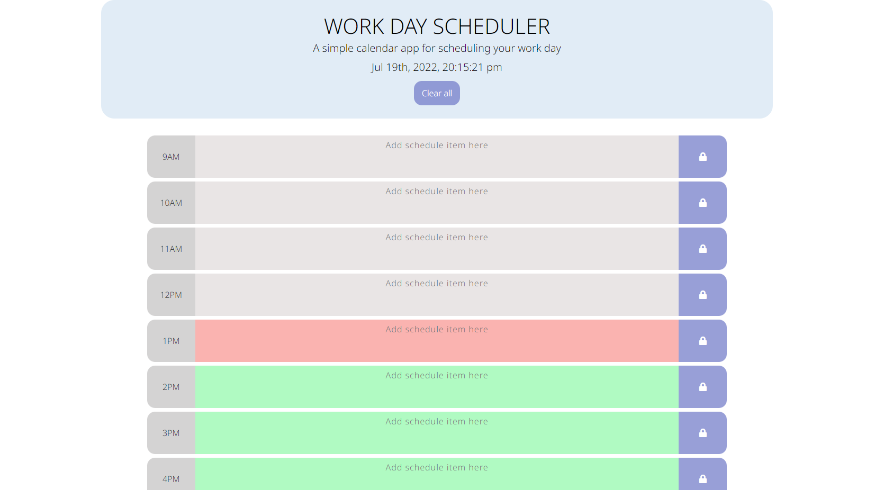

# Work Day Scheduler Starter Code

A simple calendar application that allows the user to create a schedule for standard business hours with the option to events for each hour of the day. It highlights the current hour, while also indicates the hours of the day that have past, just as the ones that are about to come. This app runs in the browser and features dynamically updated HTML and CSS powered by jQuery.

## Links 

Deployed URL: https://jcuetos97.github.io/Work-Day-Scheduler/

GitHub Repository URL: https://github.com/jcuetos97/Work-Day-Scheduler

    

